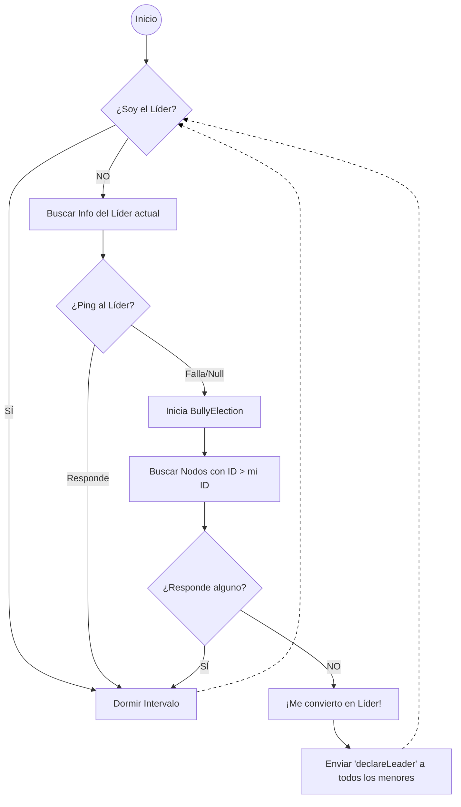
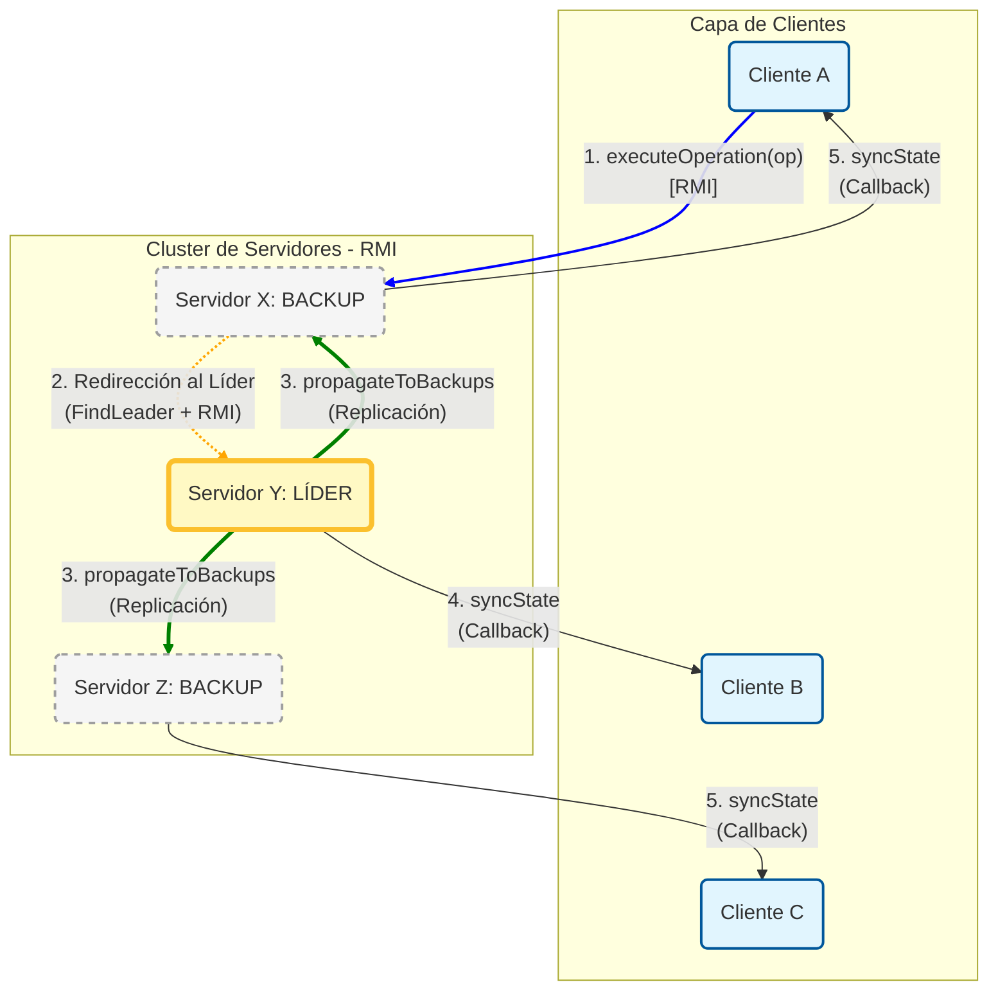
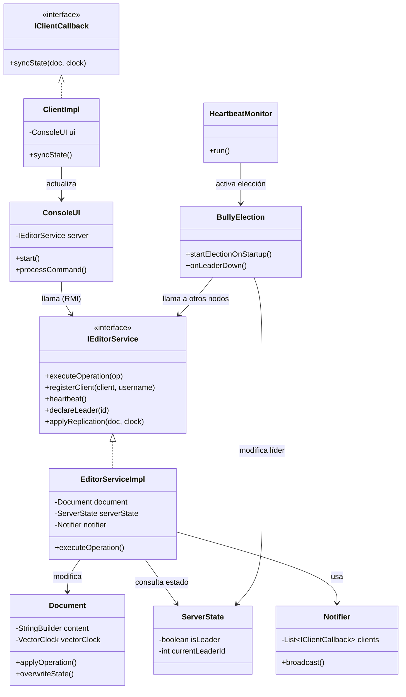
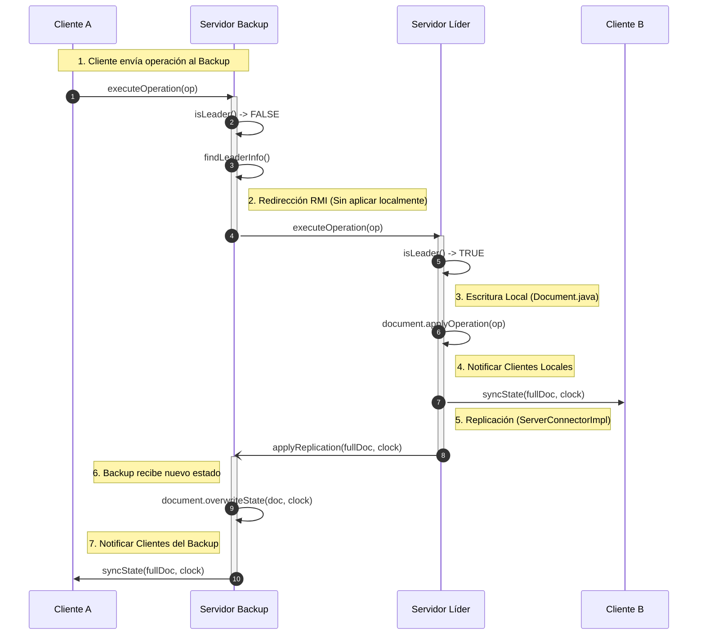
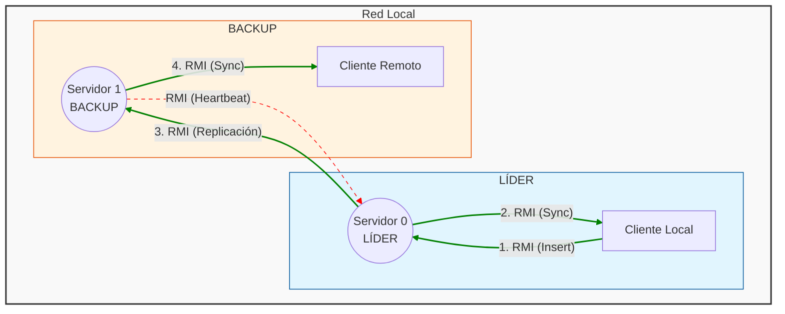

# Editor Colaborativo Distribuido
Sistema de edición colaborativa en tiempo real implementado en **Java RMI** bajo una arquitectura **Primary-Backup** para alta disponibilidad. 
Incorpora el **Algoritmo de Bully** para la elección dinámica de líder y utiliza **Relojes Vectoriales** (Vector Clocks) para gestionar la causalidad y consistencia eventual entre réplicas.

