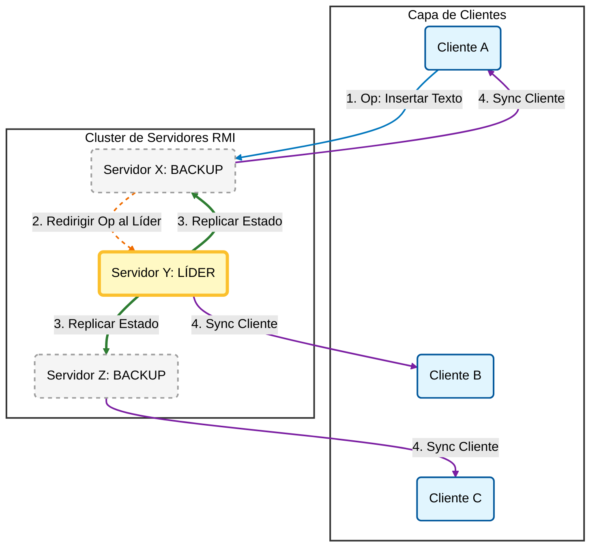
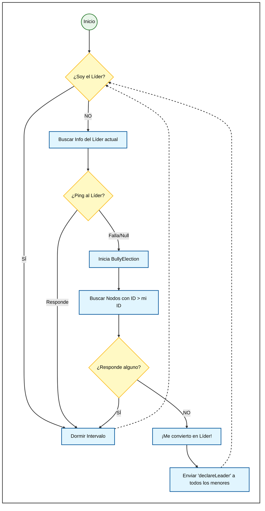
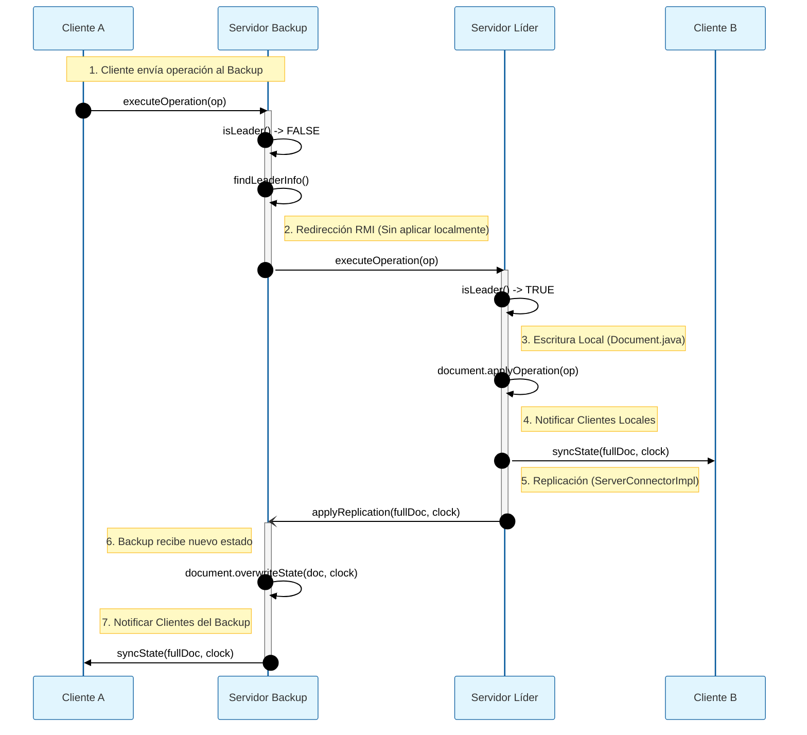
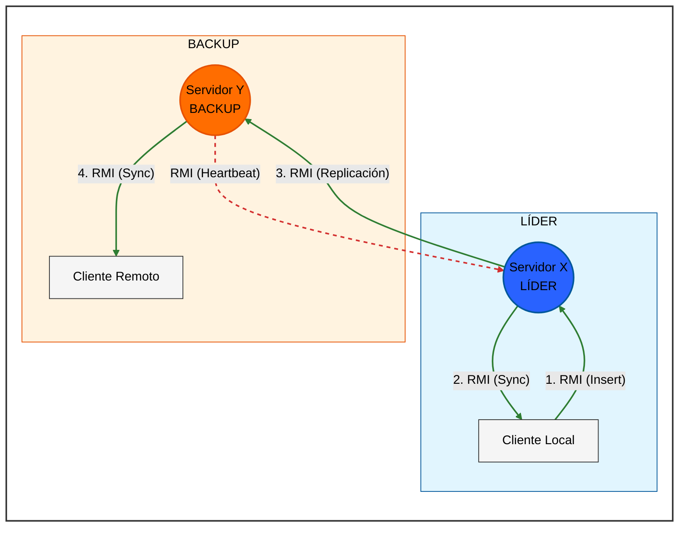

# Editor Colaborativo Distribuido
Sistema de edición colaborativa en tiempo real implementado en **Java RMI** bajo una arquitectura **Primary-Backup** para alta disponibilidad.  
Incorpora el **Algoritmo de Bully** para la elección dinámica de líder y utiliza **Relojes Vectoriales** (Vector Clocks) para gestionar la causalidad y consistencia eventual entre réplicas.
# Esquemas
### 1 . Arquitectura Lógica y Flujo de funcionamiento
Ilustra el flujo de una operación iniciada en un nodo Backup.  
Podemos observar la redirección automática de la operación hacia el servidor Líder, la propagación interna del estado a las réplicas y la sincronización final (callback) a todos los clientes conectados para garantizar que todos vean el documento actualizado.

### 2 . Lógica de elección del Líder y recuperación (Algoritmo de Bully)
Se verifica continuamente la disponibilidad del líder mediante heartbeats periódicos. Ante la detección de una caída, se activa el protocolo de elección que garantiza que el servidor con el ID más alto disponible asuma el control y notifique al resto de nodos.

### 3. Protocolo de Comunicación y Replicación (Vista de Secuencia)
Diagrama de secuencia que detalla el flujo de mensajes RMI durante una operación de escritura iniciada en un nodo Backup. Para una correcta visualización usar un tema claro.

### 4. Topología de Red y Monitorización Concurrente
Representa el el flujo de datos principal (escritura y replicación RMI) y se destaca el mecanismo de Heartbeat, el cual se ejecuta paralela e independientemente. Esto permite que los nodos Backup verifiquen la disponibilidad del Líder de forma continua y concurrente sin bloquear las operaciones de edición en tiempo real.

